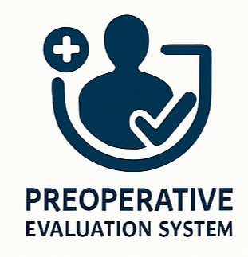

<h1 align="center">
  
</h1>
---

[Releases][release]&nbsp;&nbsp;&nbsp;|&nbsp;&nbsp;&nbsp;[Fonts](#patched-fonts)&nbsp;&nbsp;&nbsp;|&nbsp;&nbsp;&nbsp;[Font Patcher](#font-patcher)&nbsp;&nbsp;&nbsp;|&nbsp;&nbsp;&nbsp;[Wiki Documentation][wiki]&nbsp;&nbsp;&nbsp;|&nbsp;&nbsp;&nbsp;[Stickers][stickers]&nbsp;&nbsp;&nbsp;|&nbsp;&nbsp;&nbsp;[VimDevIcons][vim-devicons]

[![GitHub release][img-version-badge]][repo] [![Gitter][img-gitter-badge]][gitter] [![Code of Conduct][coc-badge]][coc] [![PRs Welcome][prs-badge]][prs]  

# **🏥 Preoperative Evaluation System ⚕️**

## **📜 Overview**

The increasing demands placed on public healthcare institutions, particularly in preoperative assessment, underscore the need for innovative solutions that enhance efficiency, accuracy, and patient-centred care. This project introduces a **web-based “Preoperative Evaluation” system** 💻 designed to **modernize and streamline surgical preparation**  within public healthcare institutions. The system aims to enhance **efficiency, accuracy, and patient-centered care ❤** by facilitating the **digital submission  and review  of preoperative questionnaires**. This allows patients to securely provide their medical histories and receive timely evaluations from anesthesiologists.

The platform facilitates efficient communication  and coordination among **patients, anesthesiologists, and doctors** by enabling the **electronic submission, review, and approval of preoperative questionnaires**. It reduces reliance on paper-based forms , minimizes administrative delays, and ensures healthcare professionals can make informed decisions based on accessible and structured patient data .

The system facilitates secure registration and authentication of users, allowing patients to create profiles and submit detailed medical histories through a structured preoperative questionnaire. Once submitted, anesthesiologists receive notifications to review the information, add evaluative notes, and determine whether the patient is medically fit to proceed with surgery. Only after approval by the anesthesiologist can doctors access the relevant patient records, review them, and proceed to schedule surgical appointments.
The website lacked security implementations, so encryption was added to secure patient data. The project implemented AES-GCM to ensure both confidentiality and data integrity for patients. This method was chosen due to its strong security guarantees and efficiency.

## **🛠️ Technologies Used**

The Preoperative Evaluation system utilizes the following technologies:

*   **💻 Flask:** Web framework for backend development.
*   **🐍Python:** Programming language.
*   **🎨 Bootstrap:** Front-end framework for responsive and user-friendly interface design.
*   **🌐 HTML & CSS:** Markup and styling languages for the user interface.
*   **☁️ Render:** Cloud-based hosting platform for deployment.
*   **🐘 PostgreSQL:** Relational database management system for secure data storage.
*   **🔗 SQLAlchemy:** Flask's built-in Object Relational Mapper (ORM) for database interaction using Python.
*   **🏛️ Flask MVC template:** Used for structuring the application.
*   **🧑‍💻 GitHub & Gitpod:** Development tools for collaboration, version control, cloud-based development, testing, and code editing.

## **🚀 Deployment**

The deployed application can be accessed at: **[https://preoperative-evaluation-9t5i.onrender.com/](https://preoperative-evaluation-9t5i.onrender.com/)** 🔗.

## **🧪 Testing**

The project underwent various levels of testing to ensure functionality and reliability:

*   **✅ User Acceptance Tests (UAT):** Conducted for patients, anesthesiologists, and doctors to validate key workflows such as signup, login, questionnaire submission/review, and appointment scheduling.
*   **🧩 Unit Tests:** Focused on testing individual components (models) of the system, such as patient, anesthesiologist, doctor, questionnaire, and notification models, to ensure they function as expected.
*   **🔗 Integration Tests:** Aimed at verifying the interaction and data flow between different parts of the system, ensuring that components work correctly together.

# Application overview

## **🔑 Key Features**

### **🧑‍⚕️ Patients**

*   **🔒 Secure Registration and Authentication:** Patients can securely register and log in to the system.
*   **👤 Profile Management:** Patients can create and manage their profiles.
*   **📝 Medical History Submission:** Patients can submit detailed medical histories through a structured online questionnaire.
*   **⏱️ Questionnaire Status Tracking:** Patients can view the status and progress of their submitted questionnaires.
*   **🔔 Notification System:** Patients receive real-time alerts regarding the status of their questionnaire.
*   **💬 Communication:** Patients can communicate with both doctors and anesthesiologists.
*   **📅 View Operation Date:** Patients can view their assigned operation date once approved.

---

### **👩‍⚕️ Anesthesiologists**

*   **🔒 Secure Login and Authentication:** Anesthesiologists can securely log in to the system.
*   **🧑‍⚕️ Patient Management:** Anesthesiologists can view a list of their assigned patients.
*   **📜 Medical History Review:** Anesthesiologists can view the medical history of their assigned patients.
*   **🧐 Questionnaire Review and Approval:** Anesthesiologists can view patient questionnaire results, add evaluative notes ✍️, and approve 👍 or deny 👎 them based on medical assessments.
*   **🔔 Notification System:** Anesthesiologists receive notifications for incoming patient questionnaires.
*   **💬 Communication:** Anesthesiologists can communicate with both doctors and patients.

---

### **👨‍⚕️ Doctors**

*   **🔒 Secure Login and Authentication:** Doctors can securely log in to the system.
*   **🧑‍⚕️ Patient Management:** Doctors can view a list of their assigned patients.
*   **✅ Access to Approved Records:** Doctors can access only those patient records and questionnaires that have been approved by the anesthesiologist.
*   **📜 Medical History Review:** Doctors can view the medical history of their patients.
*   **✅ Questionnaire Review:** Doctors can view the anesthesiologist-approved patient questionnaires.
*   **✍️ Note Taking:** Doctors can leave notes for approved questionnaires.
*   **🗓️ Appointment Scheduling:** Doctors can approve 👍/deny 👎 patients for surgery and schedule surgical appointments.
*   **💬 Communication:** Doctors can communicate with both anesthesiologists and patients.

## Deploy to Render

